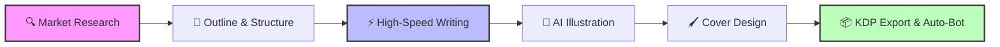

<div align="center">

# 📚 FraudRob's AI Book Factory
### The Ultimate AI-Powered Amazon KDP Publishing Suite

[](https://reactjs.org/)
[](https://www.typescriptlang.org/)
[](https://ai.google.dev/)
[](https://tailwindcss.com/)
[](https://opensource.org/licenses/MIT)

**Research • Write • Illustrate • Design • Publish**

[Report Bug](https://github.com/yourusername/fraudrobs-book-factory/issues) · [Request Feature](https://github.com/yourusername/fraudrobs-book-factory/issues)

</div>

---

## 🚀 Overview

**FraudRob's AI Book Factory** is not just another text generator—it is a comprehensive, full-stack publishing suite designed to dominate the Amazon KDP market. 

Leveraging the raw power of **Google's Gemini 2.5 & 3.0 models**, this application automates the entire lifecycle of book creation. From identifying high-profit niches using simulated market data to generating full-length manuscripts with high-concurrency threading, custom illustrations, and ready-to-upload KDP metadata.

### 🖼️ Workflow Visualization



---

## ✨ Key Features

### 🧠 1. Intelligent Market Research
Don't write blindly. The app analyzes trends before you type a single word.
*   **Niche Finder:** Identifies profitable, low-competition genres.
*   **Trend Simulation:** Generates visual Google Trends data simulations.
*   **Competitor Analysis:** AI agents analyze potential competitors to find market gaps.
*   **Audience Profiling:** Deep dives into demographics, pain points, and interests.

### ✍️ 2. Advanced Manuscript Generation
*   **High-Concurrency Mode:** Blasts API requests in parallel threads to generate full books in minutes, not hours.
*   **Director's Mode:** Give surgical instructions ("Make this scene darker," "Add a plot twist") and watch the AI rewrite instantly.
*   **The Critic Agent:** A dedicated "Grand Master Scholar" agent reviews chapters and provides literary critique before rewriting them for quality.
*   **Humanization Engine:** Post-processing algorithms to smooth out AI-sounding prose.

### 🎨 3. Visuals & Cover Design
*   **AI Illustration:** Generates scene-specific prompts and renders images for every chapter (Cinematic, Anime, Watercolor, and more).
*   **Integrated Cover Editor:** Full FabricJS-powered drag-and-drop editor.
    *   AI Stock Photo Search
    *   Custom Typography Control
    *   Layer Management
*   **Author Persona Generator:** Creates fake but realistic author bios, headshots, and action shots for pen names.

### 📦 4. Deployment & Automation
*   **One-Click EPUB:** Generates formatted `.epub` files ready for Kindle.
*   **KDP Metadata Suite:** Auto-generates SEO-optimized Titles, Subtitles, 7-Backend Keywords, and HTML-formatted descriptions.
*   **Smart Download:** Zips the Manuscript, Cover, and a "Publishing Guide" into a single package.
*   **Automation Bot (Beta):** Includes a backend service (Playwright) to physically automate the upload process to Amazon KDP, complete with CAPTCHA handling.

### 🏭 5. Batch Production Mode
*   **Series Generator:** Define a genre and generate **entire book series** (Book 1, 2, 3...) in a single run.
*   **Mass Production:** Queue up to 10 projects and let the factory run in the background.

---

## 🛠️ Technical Stack

*   **Frontend:** React 18, TypeScript, Tailwind CSS
*   **AI Core:** Google GenAI SDK (Gemini 2.5 Flash, Gemini 3.0 Pro)
*   **State Management:** IndexedDB (Custom wrapper for massive storage capacity beyond 5MB)
*   **Graphics:** FabricJS (Canvas manipulation), Pollinations.ai (Image Generation)
*   **Export:** JSZip, Epub-Gen-ES
*   **Desktop Wrapper:** Tauri v2 (Rust)
*   **Backend (Optional Bot):** Node.js, Express, WebSockets, Playwright

---

## 🗂️ AppData Storage (Desktop)

When running as a Tauri desktop app, all application data is stored under the OS AppData directory so it is never mixed with project files.

| Data | Path |
| :--- | :--- |
| Window size / position | `%APPDATA%\com.tauri.dev\window-state.json` |
| App state & databases | `%APPDATA%\com.tauri.dev\` |

> **macOS / Linux** use the platform-equivalent paths:
> *   macOS: `~/Library/Application Support/com.tauri.dev/`
> *   Linux: `~/.local/share/com.tauri.dev/`

### Window State Behaviour

*   **Restored on launch** – the previous window size and position are read from `window-state.json` and applied before the window is shown, so there is no visible flicker.
*   **Maximized state** – if the app was closed while maximized it reopens maximized.
*   **Off-screen clamping** – on launch the saved bounds are clamped to the current monitor's work area, so the window can never open off-screen after a monitor layout change.
*   **Auto-saved** – any resize or move triggers a debounced write (≤ 500 ms after activity stops). An additional immediate save is performed when the window is closed.

---

## 💾 Installation & Setup

1.  **Clone the Repo**
    ```bash
    git clone https://github.com/yourusername/fraudrobs-book-factory.git
    cd fraudrobs-book-factory
    ```

2.  **Install Dependencies**
    ```bash
    npm install
    ```

3.  **Configure API Key**
    Create a `.env` file in the root directory:
    ```env
    API_KEY=your_google_gemini_api_key_here
    ```

4.  **Run the App**
    ```bash
    npm start
    ```

### 🤖 Setting up the Automation Bot (Optional)

To use the KDP Auto-Uploader, you need to run the separate backend server.

1.  Navigate to `server/`
2.  `npm install`
3.  `npx playwright install`
4.  Set KDP credentials (safe env vars):
    ```bash
    export KDP_EMAIL="your@email.com"
    export KDP_PASSWORD="yourpassword"
    ```
5.  `npm start`

---

## 🖼️ Gallery

| Market Research | Cover Editor | Manuscript Writer |
| :---: | :---: | :---: |
| *Analyze Trends* | *Drag & Drop Design* | *Director's Mode* |
|  |  |  |

---

## 🤝 Contributing

Contributions are what make the open-source community such an amazing place to learn, inspire, and create. Any contributions you make are **greatly appreciated**.

1.  Fork the Project
2.  Create your Feature Branch (`git checkout -b feature/AmazingFeature`)
3.  Commit your Changes (`git commit -m 'Add some AmazingFeature'`)
4.  Push to the Branch (`git push origin feature/AmazingFeature`)
5.  Open a Pull Request

---

## ⚠️ Disclaimer

This tool is intended for educational and productivity purposes. Users are responsible for adhering to Amazon KDP's Terms of Service regarding AI-generated content. Always review AI output before publishing.

---

<div align="center">
  <p>Built with ❤️ by FraudRob</p>
  <p>
    <a href="#">Website</a> •
    <a href="#">Documentation</a> •
    <a href="#">Support</a>
  </p>
</div>
