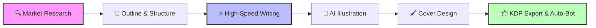

<div align="center">

# 📚 FraudRob's AI Book Factory
### The Ultimate AI-Powered Amazon KDP Publishing Suite

[](https://reactjs.org/)
[](https://www.typescriptlang.org/)
[](https://ai.google.dev/)
[](https://tailwindcss.com/)
[](https://opensource.org/licenses/MIT)

**Research • Write • Illustrate • Design • Publish**

[Report Bug](https://github.com/yourusername/fraudrobs-book-factory/issues) · [Request Feature](https://github.com/yourusername/fraudrobs-book-factory/issues)

</div>

---

## 🚀 Overview

**FraudRob's AI Book Factory** is not just another text generator—it is a comprehensive, full-stack publishing suite designed to dominate the Amazon KDP market. 

Leveraging the raw power of **Google's Gemini 2.5 & 3.0 models**, this application automates the entire lifecycle of book creation. From identifying high-profit niches using simulated market data to generating full-length manuscripts with high-concurrency threading, custom illustrations, and ready-to-upload KDP metadata.

### 🖼️ Workflow Visualization



---

## ✨ Key Features

### 🧠 1. Intelligent Market Research
Don't write blindly. The app analyzes trends before you type a single word.
*   **Niche Finder:** Identifies profitable, low-competition genres.
*   **Trend Simulation:** Generates visual Google Trends data simulations.
*   **Competitor Analysis:** AI agents analyze potential competitors to find market gaps.
*   **Audience Profiling:** Deep dives into demographics, pain points, and interests.

### ✍️ 2. Advanced Manuscript Generation
*   **High-Concurrency Mode:** Blasts API requests in parallel threads to generate full books in minutes, not hours.
*   **Director's Mode:** Give surgical instructions ("Make this scene darker," "Add a plot twist") and watch the AI rewrite instantly.
*   **The Critic Agent:** A dedicated "Grand Master Scholar" agent reviews chapters and provides literary critique before rewriting them for quality.
*   **Humanization Engine:** Post-processing algorithms to smooth out AI-sounding prose.

### 🎨 3. Visuals & Cover Design
*   **AI Illustration:** Generates scene-specific prompts and renders images for every chapter (Cinematic, Anime, Watercolor, and more).
*   **Integrated Cover Editor:** Full FabricJS-powered drag-and-drop editor.
    *   AI Stock Photo Search
    *   Custom Typography Control
    *   Layer Management
*   **Author Persona Generator:** Creates fake but realistic author bios, headshots, and action shots for pen names.

### 📦 4. Deployment & Automation
*   **One-Click EPUB:** Generates formatted `.epub` files ready for Kindle.
*   **KDP Metadata Suite:** Auto-generates SEO-optimized Titles, Subtitles, 7-Backend Keywords, and HTML-formatted descriptions.
*   **Smart Download:** Zips the Manuscript, Cover, and a "Publishing Guide" into a single package.
*   **Automation Bot (Beta):** Includes a backend service (Playwright) to physically automate the upload process to Amazon KDP, complete with CAPTCHA handling.

### 🏭 5. Batch Production Mode
*   **Series Generator:** Define a genre and generate **entire book series** (Book 1, 2, 3...) in a single run.
*   **Mass Production:** Queue up to 10 projects and let the factory run in the background.

---

## 🖥️ Window State Persistence (Desktop / Tauri)

When running as a desktop app (Tauri wrapper), the application automatically saves and restores your window size, position, and maximized state between sessions.

*   **Storage location:** A `window-state.json` file inside the application's AppData directory (e.g. `%AppData%\<app-identifier>\` on Windows).
*   **Monitor awareness:** On next launch the window reopens on the same monitor if it is still connected; otherwise it falls back to a monitor containing the saved top-left corner, then to the primary monitor.
*   **Shrink-to-fit:** If the saved size is larger than the target monitor, the window is shrunk to fit.
*   **16 px margin:** When clamping or shrinking, a 16 px inset is kept from every edge of the monitor work area so the window is never flush against the screen border.
*   **Minimum size:** The window is never restored smaller than 400 × 300 px.
*   **Maximized state:** If the app was closed while maximized it reopens maximized, while the normal (restored) rectangle is still preserved for when you un-maximize.

---

## 🛠️ Technical Stack

*   **Frontend:** React 18, TypeScript, Tailwind CSS
*   **AI Core:** Google GenAI SDK (Gemini 2.5 Flash, Gemini 3.0 Pro)
*   **State Management:** IndexedDB (Custom wrapper for massive storage capacity beyond 5MB)
*   **Graphics:** FabricJS (Canvas manipulation), Pollinations.ai (Image Generation)
*   **Export:** JSZip, Epub-Gen-ES
*   **Backend (Optional Bot):** Node.js, Express, WebSockets, Playwright

---

## 💾 Installation & Setup

1. **Clone the repo**
   ```bash
   git clone https://github.com/crazyrob425/KDP-E-Book-Generator.git
   cd KDP-E-Book-Generator
   ```

2. **Install dependencies**
   ```bash
   npm install
   ```

3. **Configure environment variables**
   Create a `.env` file in the project root:
   ```env
   VITE_GOOGLE_API_KEY=your_google_gemini_api_key_here
   KDP_EMAIL=your-kdp-email@example.com
   KDP_PASSWORD=your-kdp-password
   ```
   Notes:
   - `VITE_GOOGLE_API_KEY` is required for AI generation in the frontend.
   - `KDP_EMAIL` and `KDP_PASSWORD` are required only for automation flows that run browser automation.
   - Some code paths still support `API_KEY` fallback, but `VITE_GOOGLE_API_KEY` is the canonical setting.

4. **Run in development**
   ```bash
   npm run dev
   ```

5. **Build for production**
   ```bash
   npm run build
   ```

## 🖥️ Supported Runtime Modes

### 1) Web UI mode
- Run: `npm run dev`
- Supports the core authoring workflow (research, outline, generation, review).
- Electron-specific features (custom window controls, IPC-backed file dialogs, local automation worker bridge) are not guaranteed in plain browser mode.

### 2) Electron desktop mode (primary automation path)
- Frontend + Electron preload/main process integration.
- KDP automation component currently uses Electron IPC as the active transport path.
- Uses handlers defined in `electron/main.ts` and API exposed in `electron/preload.ts`.

### 3) Standalone backend automation mode (optional)
- `server/server.ts` provides a WebSocket backend path for automation workflows.
- Treat this as an optional deployment mode for remote automation hosting scenarios.
- See `server/README.md` for backend setup and deployment details.

### 🤖 Automation Bot Setup (Optional)

To run browser automation reliably:

1. Install dependencies in the root project (`npm install`).
2. Install Playwright browsers:
   ```bash
   npx playwright install
   ```
3. Set:
   - `KDP_EMAIL`
   - `KDP_PASSWORD`

If using the standalone backend mode, follow `/server/README.md`.

## ✅ Validation Commands

- Frontend build:
  ```bash
  npm run build
  ```
- Server TypeScript check:
  ```bash
  npx tsc -p server/tsconfig.json --noEmit
  ```

## 🧩 Windows Installer Prep (NSIS)

- Build NSIS branding assets:
  ```bash
  npm run brand:nsis
  ```
- Generate release update metadata scaffold:
  ```bash
  npm run release:scaffold-update
  ```

## 🛠️ Troubleshooting

- **`vite: not found`**
  - Run `npm install` first, then rerun `npm run build` or `npm run dev`.

- **Missing API key errors**
  - Ensure `.env` contains `VITE_GOOGLE_API_KEY`.

- **Playwright launch/automation failures**
  - Run `npx playwright install`.
  - Ensure `KDP_EMAIL` and `KDP_PASSWORD` are present in environment.

- **IPC-only feature errors in browser mode**
  - Features relying on `window.electronAPI` require Electron desktop runtime.

- **Backend connectivity mismatch**
  - Electron automation flow uses IPC.
  - Standalone backend flow requires a running WebSocket backend on the expected URL/path.

---

## 🖼️ Gallery

| Market Research | Cover Editor | Manuscript Writer |
| :---: | :---: | :---: |
| *Analyze Trends* | *Drag & Drop Design* | *Director's Mode* |
|  |  |  |

---

## 🤝 Contributing

Contributions are what make the open-source community such an amazing place to learn, inspire, and create. Any contributions you make are **greatly appreciated**.

1.  Fork the Project
2.  Create your Feature Branch (`git checkout -b feature/AmazingFeature`)
3.  Commit your Changes (`git commit -m 'Add some AmazingFeature'`)
4.  Push to the Branch (`git push origin feature/AmazingFeature`)
5.  Open a Pull Request

---

## ⚠️ Disclaimer

This tool is intended for educational and productivity purposes. Users are responsible for adhering to Amazon KDP's Terms of Service regarding AI-generated content. Always review AI output before publishing.

---

<div align="center">
  <p>Built with ❤️ by FraudRob</p>
  <p>
    <a href="#">Website</a> •
    <a href="#">Documentation</a> •
    <a href="#">Support</a>
  </p>
</div>
